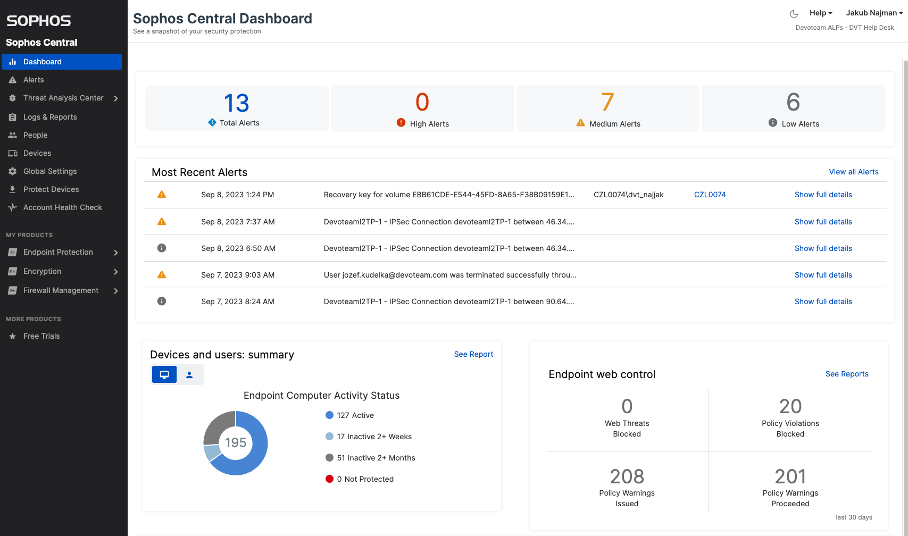

# Admin Dashboard
### About the project
Admin Dashboard is one of many exercises completed during completing The Odin Project web development course.  
This mock admin dashboard was built as a way to showcase the CSS grid knowledge that has been taught so far in this course.
I used Sophos security admin dashboard as a template.

### Template

### Resources used
- https://pictogrammers.com/library/mdi/ (icons)
- https://codepen.io/sosuke/pen/Pjoqqp (css filter generator)
- https://brand.sophos.com/sophos/downloads (Sophos logo)

### Built With
- HTML
- CSS (Grid + Flexbox)